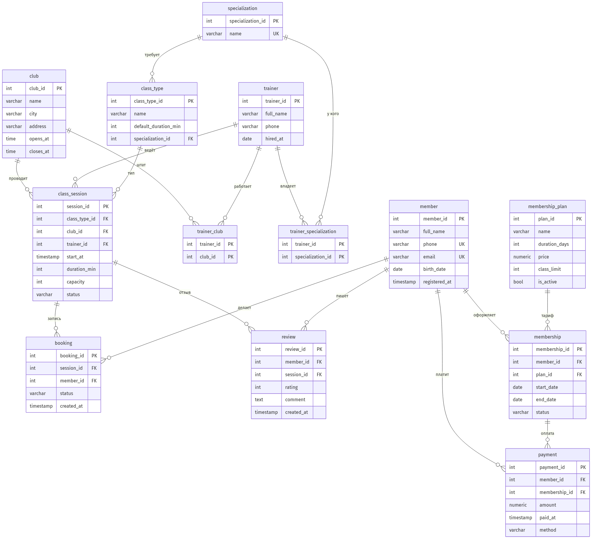

# GymFlow — БД сети фитнес-студий


Учебный проект по курсу **«Конструирование баз данных»**: проектирование реляционной БД
для сети фитнес-студий — студии, абонементы, групповые занятия с ограниченной вместимостью,
тренеры, бронирования с листом ожидания, оплаты и отзывы.

Репозиторий содержит **рабочую базу на PostgreSQL**: DDL, тестовые данные, набор запросов
(включая оконные функции), транзакции и триггеры — всё прогоняется одним набором скриптов.

---

## Схема данных



> Исходники диаграммы: [`er_diagram.md`](er_diagram.md) (Mermaid) и [`gymflow.dbml`](gymflow.dbml)
> (для [dbdiagram.io](https://dbdiagram.io)).

**13 таблиц** в 4NF:

| Группа | Таблицы |
|---|---|
| Студии и клиенты | `club`, `member`, `membership_plan`, `membership` |
| Тренеры | `trainer`, `specialization`, `trainer_specialization`, `trainer_club` |
| Расписание | `class_type`, `class_session`, `booking` |
| Финансы и отзывы | `payment`, `review` |

Связующие таблицы `trainer_specialization` и `trainer_club` — результат декомпозиции
многозначной зависимости `trainer_id →→ specialization | club` в 4NF.

---

## Быстрый старт

### Через Docker (рекомендуется)

> Выполняй из корня репозитория (где лежат `.sql`-файлы) — `${PWD}` монтирует именно его.

```bash
# 1. поднять PostgreSQL и смонтировать папку проекта в /sql
docker run -d --name gymflow \
  -e POSTGRES_PASSWORD=postgres -e POSTGRES_DB=gymflow \
  -v "${PWD}:/sql" postgres:16-alpine

# 2. накатить схему, данные и триггеры
docker exec gymflow psql -U postgres -d gymflow -f /sql/schema.sql
docker exec gymflow psql -U postgres -d gymflow -f /sql/seed.sql
docker exec gymflow psql -U postgres -d gymflow -f /sql/triggers.sql

# 3. прогнать запросы
docker exec gymflow psql -U postgres -d gymflow -f /sql/queries.sql

# интерактивная сессия:
docker exec -it gymflow psql -U postgres -d gymflow
```

### Через локальный PostgreSQL

```bash
createdb gymflow
psql -d gymflow -f schema.sql
psql -d gymflow -f seed.sql
psql -d gymflow -f triggers.sql
psql -d gymflow -f queries.sql
```
---

## Структура репозитория

| Файл | Назначение |
|---|---|
| [`schema.sql`](schema.sql) | DDL: 13 таблиц, PK/FK, `CHECK`/`UNIQUE`, индексы |
| [`seed.sql`](seed.sql) | Тестовые данные (относительные даты) |
| [`queries.sql`](queries.sql) | 6 простых + 4 сложных запроса с комментариями |
| [`transactions.sql`](transactions.sql) | 3 транзакции (бронь+waitlist, оплата, отмена+продвижение) |
| [`triggers.sql`](triggers.sql) | Доп. ограничения, которые `CHECK` не выражает |
| [`verify.py`](verify.py) | Проверка логики на SQLite (без Postgres) |
| [`er_diagram.md`](er_diagram.md) · [`gymflow.dbml`](gymflow.dbml) · `er_diagram.png` | ER-диаграмма |

---

## Ключевые запросы (`queries.sql`)

| Запрос | Что делает | SQL-приёмы |
|---|---|---|
| **Q7** | Топ-5 занятий по заполняемости за прошлый месяц | `JOIN` · `GROUP BY` · `FILTER` · `RANK() OVER` |
| **Q8** | Выручка по месяцам + рост и нарастающий итог | подзапрос · `LAG()` · `SUM() OVER` |
| **Q9** | Клиенты «платят, но не ходят» | `EXISTS` / `NOT EXISTS` (анти-join) |
| **Q10** | Загрузка тренеров за неделю | две `CTE` (защита от fan-out) |

---

## Транзакции (`transactions.sql`)

- **Бронирование с лимитом мест** — `SELECT … FOR UPDATE` на занятии исключает гонку за
  последнее место; при заполнении бронь уходит в лист ожидания.
- **Покупка абонемента** — оплата и активация атомарно (нет состояния «заплатил, а доступа нет»).
- **Отмена + продвижение из листа ожидания** — `FOR UPDATE SKIP LOCKED`, чтобы две
  параллельные отмены не подняли одного и того же клиента.

## Триггеры (`triggers.sql`)

Правила, ссылающиеся на другие таблицы (обычный `CHECK` так не умеет):

- активную бронь можно создать только при действующем абонементе на дату занятия;
- тренер ведёт занятие только в студии, к которой прикреплён.

> Контроль вместимости и лимита занятий по тарифу осознанно вынесен в транзакции/приложение —
> см. раздел «Спорные проектные решения» в отчёте.
