# GymFlow — ER-диаграмма

Готовая картинка — **`er_diagram.png`** (ниже). Исходники для правок:
- **Mermaid** (этот файл) — рендерится прямо в Markdown (GitHub / VS Code / Obsidian).
- **DBML** — файл **`gymflow.dbml`**, вставляется на https://dbdiagram.io (там же экспорт в PNG/PDF/SQL).

---

## Исходник Mermaid

```mermaid
erDiagram
    club        ||--o{ class_session         : "проводит"
    club        ||--o{ trainer_club           : "штат"
    trainer     ||--o{ trainer_club           : "работает"
    trainer     ||--o{ trainer_specialization : "владеет"
    specialization ||--o{ trainer_specialization : "у кого"
    specialization ||--o{ class_type           : "требует"
    trainer     ||--o{ class_session          : "ведёт"
    class_type  ||--o{ class_session          : "тип"
    class_session ||--o{ booking              : "запись"
    class_session ||--o{ review               : "отзыв"
    member      ||--o{ membership             : "оформляет"
    membership_plan ||--o{ membership         : "тариф"
    member      ||--o{ booking                : "делает"
    member      ||--o{ payment                : "платит"
    membership  ||--o{ payment                : "оплата"
    member      ||--o{ review                 : "пишет"

    club {
        int club_id PK
        varchar name
        varchar city
        varchar address
        time opens_at
        time closes_at
    }
    member {
        int member_id PK
        varchar full_name
        varchar phone UK
        varchar email UK
        date birth_date
        timestamp registered_at
    }
    membership_plan {
        int plan_id PK
        varchar name
        int duration_days
        numeric price
        int class_limit
        bool is_active
    }
    membership {
        int membership_id PK
        int member_id FK
        int plan_id FK
        date start_date
        date end_date
        varchar status
    }
    trainer {
        int trainer_id PK
        varchar full_name
        varchar phone
        date hired_at
    }
    specialization {
        int specialization_id PK
        varchar name UK
    }
    trainer_specialization {
        int trainer_id PK
        int specialization_id PK
    }
    trainer_club {
        int trainer_id PK
        int club_id PK
    }
    class_type {
        int class_type_id PK
        varchar name
        int default_duration_min
        int specialization_id FK
    }
    class_session {
        int session_id PK
        int class_type_id FK
        int club_id FK
        int trainer_id FK
        timestamp start_at
        int duration_min
        int capacity
        varchar status
    }
    booking {
        int booking_id PK
        int session_id FK
        int member_id FK
        varchar status
        timestamp created_at
    }
    payment {
        int payment_id PK
        int member_id FK
        int membership_id FK
        numeric amount
        timestamp paid_at
        varchar method
    }
    review {
        int review_id PK
        int member_id FK
        int session_id FK
        int rating
        text comment
        timestamp created_at
    }
```

